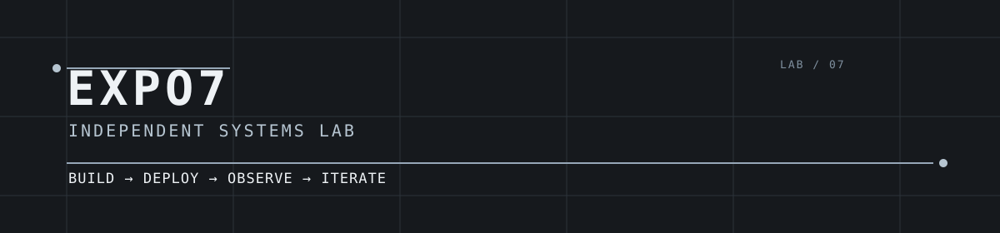

<p align="center">
  
</p>

# EXPO7

## INDEPENDENT SYSTEMS LAB

**BUILD → DEPLOY → OBSERVE → ITERATE**

One operator working with specialized AI agents, automation, and production
software to turn useful experiments into durable systems. The work spans
markets, operational intelligence, and internet-business research.

---

## Active systems

### [01 / QUANTELLE](https://github.com/expo7/alpaca)

Trading research and paper-execution system for market analysis, options ideas,
published trade records, and portfolio tracking. Django and React/Vite run with
PostgreSQL, Redis, Celery, and Docker; paper results are never presented as
real-money performance.

### [02 / AI OPTIONS DEATHMATCH](https://github.com/expo7/AI-OPTIONS-DEATHMATCH)

A public, supervised paper-trading competition between five AI-driven options
strategies. The system uses an append-only SQLite ledger, explicit order
boundaries, reconciliation gates, and a public results surface designed to show
losses as well as wins.

### [03 / ARIZONA PROJECT RADAR](https://github.com/expo7/Arizona-Project-Radar-)

Local-first desk software for reviewing Arizona construction-permit leads from
public datasets. It imports, searches, and preserves review state while keeping
the distinction clear between raw public records and verified opportunities.

### 04 / VAULT

Private operator tooling: a local credential-vault CLI for AI-assisted
workflows. AES-256-GCM encryption, scrypt-derived keys, hidden terminal input,
and metadata-only discovery keep retrieval commands shareable without exposing
the secret itself.

---

## Operating model

```text
IDEA
  ↓
SPECIFICATION
  ↓
AGENT DELEGATION
  ↓
IMPLEMENTATION
  ↓
TEST
  ↓
DEPLOY
  ↓
REAL-WORLD FEEDBACK
  ↓
ITERATE / KILL / SCALE
```

Human judgment sets the problem, constraints, and release boundary. Specialized
agents accelerate research, implementation, testing, and operations. Production
behavior decides what receives more attention.

## Working stack

The systems use a practical mix rather than a badge wall:

- **Agent-assisted development** for bounded research, implementation, review, and test work.
- **GitHub** for source control, CI, release workflows, and public system records.
- **Python, Django, React/Vite, SQLite, PostgreSQL, Redis, and Celery** where the problem warrants them.
- **Linux, Docker, Caddy, and small production infrastructure** for repeatable operation and release.
- **Public datasets, automation, and explicit audit trails** where a system must be checked against reality.

## Operating doctrine

| Principle | Practice |
| --- | --- |
| **Ship early** | Production creates information that planning cannot. |
| **Automate repeated friction** | If a task repeats, build the system that removes it. |
| **Delegate intelligently** | Use the least expensive capable agent or tool for the job. |
| **Measure reality** | Prefer observed behavior to elaborate prediction. |
| **Keep what works** | Experiments earn additional resources through results. |

## Current experiments

- [Quantelle](https://quantelle.io/) — research and paper execution in public.
- [AI Options Deathmatch](https://github.com/expo7/AI-OPTIONS-DEATHMATCH) — transparent, supervised strategy competition.
- [Arizona Project Radar](https://github.com/expo7/Arizona-Project-Radar-) — public-data lead review workflow.

<sub>EXPO7 is an independent systems lab. Paper-trading and research outputs are experiments, not investment advice or real-money performance claims.</sub>
