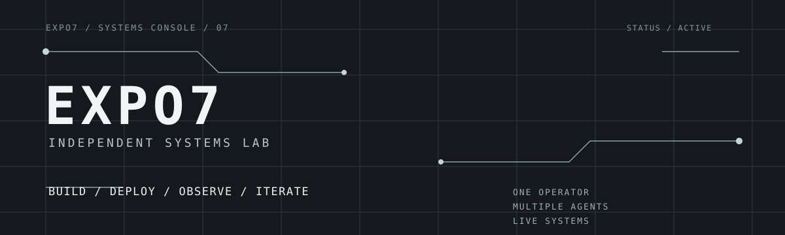
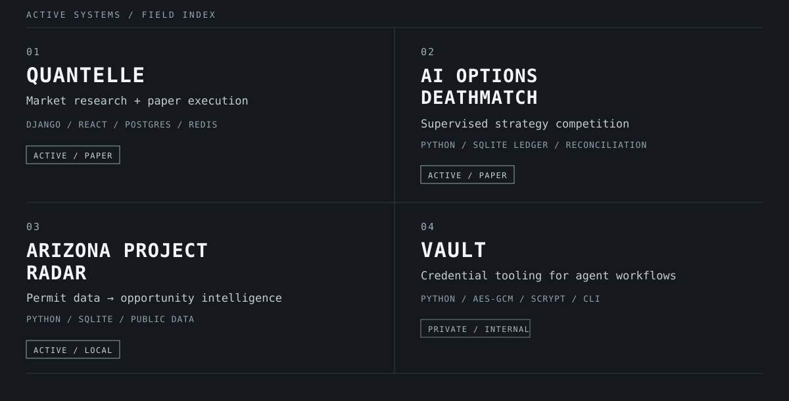
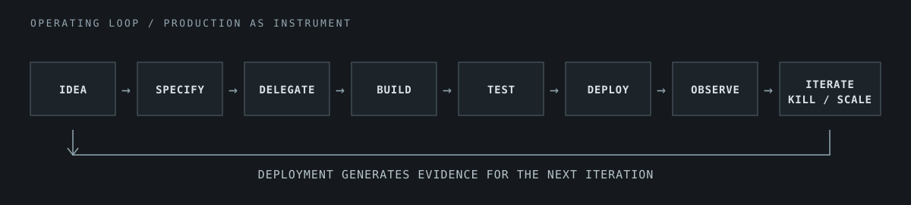
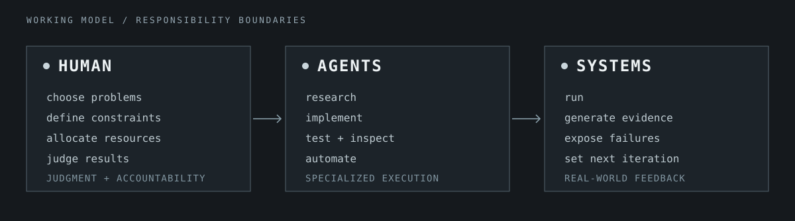
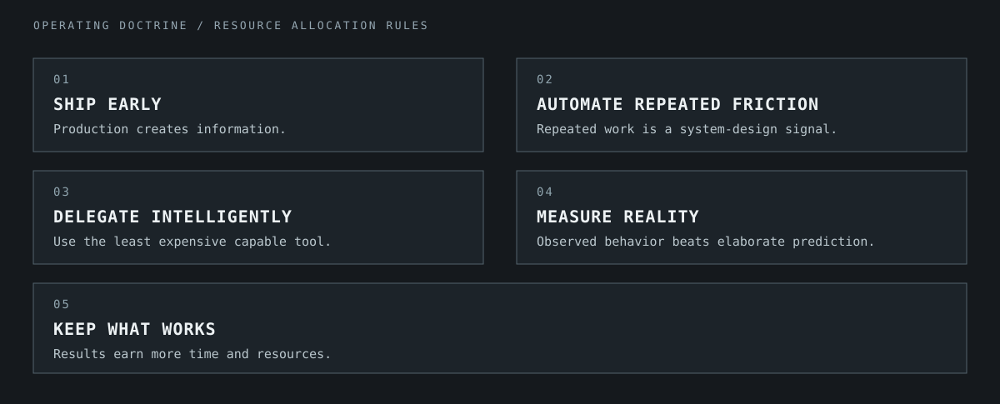

  

# EXPO7 // INDEPENDENT SYSTEMS LAB

One operator. Multiple agents. Live systems.

Systems are built fast, deployed early, and judged by what happens in reality.
The work moves across markets, automation, and useful data systems.

## ACTIVE SYSTEMS

  

**Inspect the public systems**

- [01 / Quantelle](https://github.com/expo7/alpaca) — [public site](https://quantelle.io/)
- [02 / AI Options Deathmatch](https://github.com/expo7/AI-OPTIONS-DEATHMATCH)
- [03 / Arizona Project Radar](https://github.com/expo7/Arizona-Project-Radar-)

## OPERATING LOOP

  

Production is not the finish line. It is how the lab gathers evidence for the
next decision.

## HUMAN + AGENTS + SYSTEMS

  

The human owns the problem and the release boundary. Agents extend the working
surface. Systems make the result observable.

## OPERATING DOCTRINE

  

Research and paper-trading work is experimental. It is not investment advice or a claim of real-money performance.
